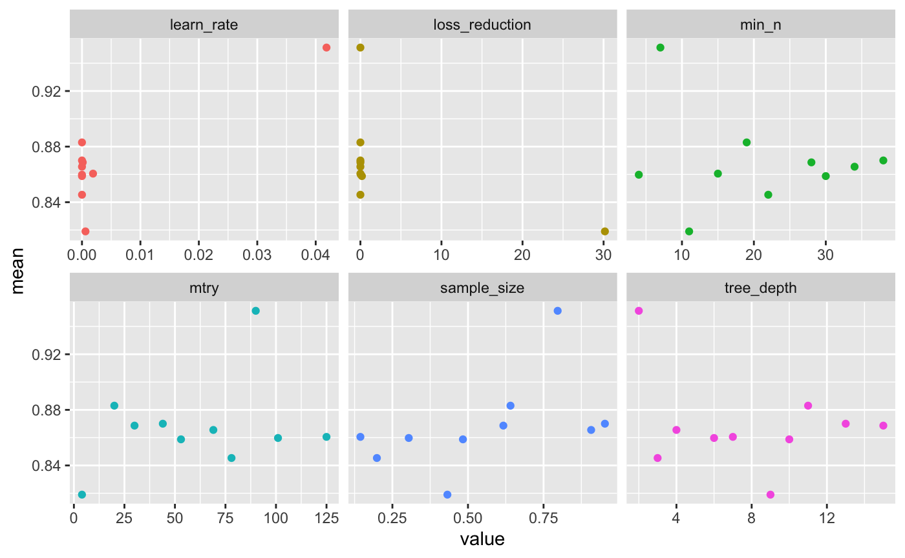
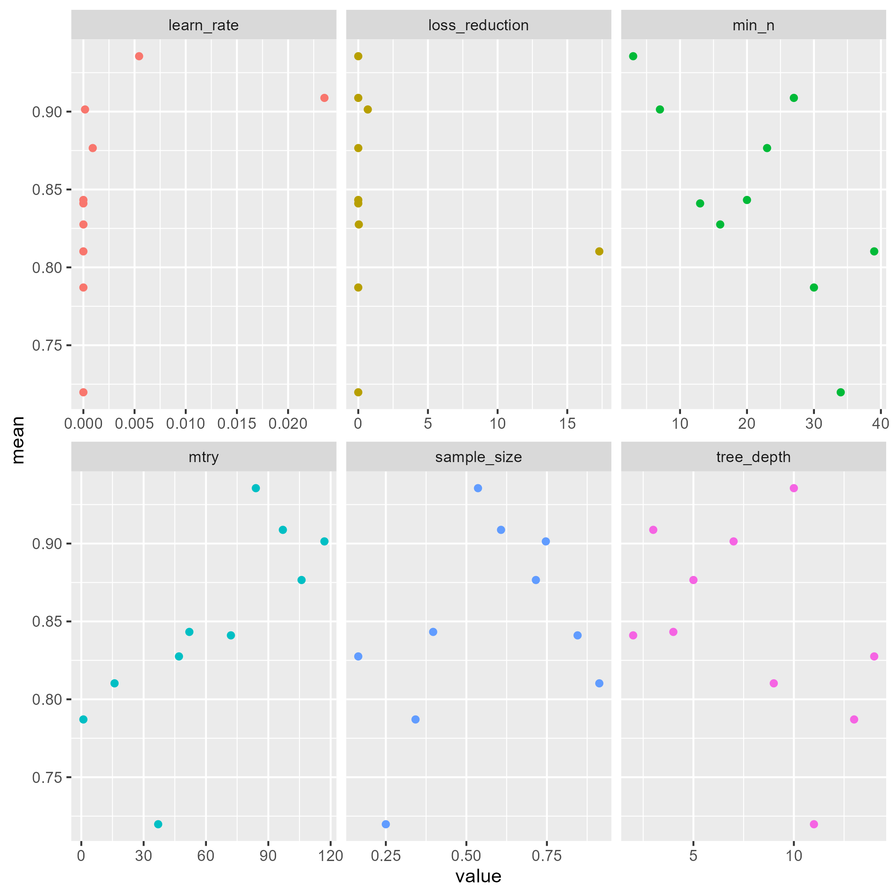

# Set-Up
If you want to knit the PDF but don't want to run the code chunks, set eval = FALSE.
```{r setup, include=TRUE}
knitr::opts_chunk$set(echo = FALSE, eval = TRUE)

set.seed(161)
```

## Import Libraries and Data
```{r, message = FALSE, echo = TRUE, eval = TRUE}
library(tidyverse)
library(tidymodels)
library(ggplot2)
library(readr)
library(patchwork)

train <- read_csv("../Data/train_class.csv")
test <- read_csv("../Data/test_class.csv")
```

# Introduction

Many models are created to attempt to predict presidential election winners. The purpose of this model is to predict the winning presidential candidate per county using the 2020 election as the training and testing data. The data includes over 3,000 counties across the US. All data was acquired from the US Census Bureau.

We believe a county's type (i.e. urban or rural) is its most substantial predictor, as urban counties tend to exclusively vote Democrat. Furthermore, we also believe the variables associated with the county's result is the age and education level, as younger and more educated voters tend to vote Democrat, with vice versa demographics typically voting Republican.

# Exploratory Data Analysis 

\vspace{1cm} 

```{r, fig.width=6, fig.height= 4.285, echo = FALSE, message = FALSE} 
ggplot(train, aes(x = winner, fill = winner)) +
  geom_bar(color = "black", alpha = 0.7) +
  scale_fill_manual(values = c("Trump" = "#FF4B4B", "Biden" = "#4B7BE1")) + 
  labs(title = "Distribution of Election Winners Across Counties", 
       x = "Winner", 
       y = "Number of Counties") +
  theme_minimal() +
  theme(
    plot.title = element_text(hjust = 0.5, size = 14, face = "bold"),
    axis.title.x = element_text(size = 12),
    axis.title.y = element_text(size = 12),
    axis.text.x = element_text(size = 10, hjust = 1)
  )
```

\begin{figure}[h!]
\centering
\caption{\textbf{Distribution of Election Winners Across Counties}}
\end{figure}

There is a clear imbalance in the number of counties won by each candidate as the plot shows a significant skew toward Trump, with him receiving nearly 2000 votes compared to Biden's approximately 500 votes. This suggests that Trump was more successful in a larger number of counties. This does not, however, account for the population density of each county.

\vspace{1cm} 

```{r, fig.width=6, fig.height= 4.285, echo = FALSE, message = FALSE}
plot1 <- ggplot(train, aes(x = winner, y = total_votes, fill = winner)) +
  geom_boxplot(outlier.colour = "black", outlier.shape = 16, outlier.size = 2) +
  scale_fill_manual(values = c("Trump" = "#FF4B4B", "Biden" = "#4B7BE1")) + 
  labs(title = "Distribution of Total Votes by Election Winner",
       x = "Election Winner",
       y = "Total Votes") +
  theme_minimal() +  
  theme(
    plot.title = element_text(face = "bold", size = 9, hjust = 0.5),
    axis.title.x = element_text(size = 8),  
    axis.title.y = element_text(size = 8),  
    axis.text.x = element_text(size = 7),
    axis.text.y = element_text(size = 7),  
    legend.position = "none")

y_axis_limit <- c(0, 800000)  # focus on the majority of data points

plot2 <- ggplot(train, aes(x = winner, y = total_votes, fill = winner)) +
  geom_boxplot(outlier.colour = "black", outlier.shape = 16, outlier.size = 2) +
  scale_fill_manual(values = c("Trump" = "#FF4B4B", "Biden" = "#4B7BE1")) + 
  labs(title = "Distribution of Total Votes by Election Winner",
       x = "Election Winner",
       y = "Total Votes") +
  coord_cartesian(ylim = y_axis_limit) +
  theme_minimal() +
  theme(
    plot.title = element_text(face = "bold", size = 9, hjust = 0.5),
    axis.title.x = element_text(size = 8),  
    axis.title.y = element_text(size = 8),  
    axis.text.x = element_text(size = 7),
    axis.text.y = element_text(size = 7),  
    legend.position = "none"
  )

combined_plot <- plot1 + plot2 + plot_layout(ncol = 2)
print(combined_plot)
```

\begin{figure}[h!]
\centering
\caption{\textbf{Distribution of Total Votes by Election Winners}}
\end{figure}

There is also a clear imbalance in the number of total votes for each candidate. Biden's boxplot is wider and higher, which indicates that in the counties where Biden won, the total number of votes cast was generally higher. This pattern indicates that Biden's support was likely stronger in more densely populated areas or regions with higher voter turnout, compared to the counties won by Trump. To investigate the difference in the distribution of wins vs. total votes, we want to investigate demographic or economic characteristics that are associated with the counties won by Trump or Biden. 

\vspace{1cm} 

```{r, fig.width=6, fig.height= 4.285, echo = FALSE, message = FALSE} 
# summary of voting patterns by urban/rural classification
summary_by_urban_rural <- train %>%
  group_by(x2013_code, winner) %>%
  summarize(total_votes = sum(total_votes, na.rm = TRUE),
            count = n(),
            .groups = 'drop')

ggplot(summary_by_urban_rural, aes(x = factor(x2013_code), y = total_votes, fill = winner)) +
  geom_bar(stat = "identity", position = "dodge", color = "black", alpha = 0.7) +
  labs(title = "Total Votes by Urban/Rural Classification and Election Winner",
       x = "Urban/Rural Classification (1 = Most Urban, 6 = Most Rural)",
       y = "Total Votes",
       fill = "winner") +
  scale_fill_manual(values = c("Trump" = "#FF4B4B", "Biden" = "#4B7BE1")) +
  theme_minimal() +
  theme(
    plot.title = element_text(hjust = 0.5, size = 14, face = "bold"),
    axis.title.x = element_text(size = 12),
    axis.title.y = element_text(size = 12),
    axis.text.x = element_text(size = 10, hjust = 1)
  )
```

\begin{figure}[h!]
\centering
\caption{\textbf{Total Votes by Urban/Rural Classification and Election Winners}}
\end{figure}

This bar plot helps us compare the total votes cast for each candidate in different urban/rural categories. This visual, especially at the extremes of 1 = Most Urban and 6 = Most Rural, highlights and supports the fact that more urban areas have higher votes for Biden, whereas more rural areas have higher votes for Trump. 

\vspace{1cm} 

```{r, fig.width=6, fig.height= 4.285, echo = FALSE, message = FALSE} 
ggplot(train, aes(x = x0009e, y = winner, color = winner)) + 
  geom_point(size = 3, alpha = 0.7) + 
  scale_color_manual(values = c("Trump" = "red", "Biden" = "blue")) +
  labs(
    title = "Choice of Candidates Among 20-24 Year Olds",
    x = "Number of 20-24 Year Olds",
    y = "Candidate"
  ) +
  theme_minimal(base_size = 15) +
  theme(
    plot.title = element_text(hjust = 0.5, face = "bold"),
    axis.title.x = element_text(margin = margin(t = 10)),
    axis.title.y = element_text(margin = margin(r = 10)),
    panel.grid.major = element_blank(),
    panel.grid.minor = element_blank()
  )
```

\begin{figure}[h!]
\centering
\caption{\textbf{Choice of Candidates Among 20-24 Year Olds}}
\end{figure}

The plot illustrates the preference for presidential candidates among 20-24 year-olds. As expected, this age group heavily skewed towards Biden, shown by the concentration of blue points. However, there was still a notable level of support for Trump, indicating that the Republican party retains some vitality and youth support, more than we initially expected. 

```{r, fig.width=6, fig.height= 4.285, echo = FALSE, message = FALSE} 
ggplot(train, aes(x = x0013e, y = winner, color = winner)) + 
  geom_point(size = 3, alpha = 0.7) + 
  scale_color_manual(values = c("Trump" = "red", "Biden" = "blue")) +
  labs(
    title = "Choice of Candidates Among 55-59 Year Olds",
    x = "Count of 55-59 Year Olds",
    y = "Candidate"
  ) +
  theme_minimal(base_size = 15) +
  theme(
    plot.title = element_text(hjust = 0.5, face = "bold"),
    plot.subtitle = element_text(hjust = 0.5, margin = margin(t = 10, b = 20)),
    axis.title.x = element_text(margin = margin(t = 10)),
    axis.title.y = element_text(margin = margin(r = 10)),
    panel.grid.major = element_blank(),
    panel.grid.minor = element_blank()
  )
```
\begin{figure}[h!]
\centering
\caption{\textbf{Choice of Candidates Among 55-59 Year Olds}}
\end{figure}

The plot illustrates candidate preferences among individuals aged 55-59. Biden is the clear leader in this age group, which aligns with the broader trend of Democratic candidates often winning the popular vote. This observation highlights the tendency of Democratic candidates to perform well across various demographics. 

```{r, fig.width=6, fig.height= 4.285, echo = FALSE, message = FALSE} 
ggplot(train, aes(x = x0016e, y = winner, color = winner)) + 
  geom_point(size = 3, alpha = 0.7) + 
  scale_color_manual(values = c("Trump" = "#E41A1C", "Biden" = "#377EB8")) + 
  labs(
    title = "Candidate Preferences Among Ages 75-84",
    x = "Count of 75-84 Year Olds",
    y = "Candidate"
  ) + 
  theme_minimal(base_size = 15) +
  theme(
    plot.title = element_text(hjust = 0.5, face = "bold"),
    plot.subtitle = element_text(hjust = 0.5, margin = margin(t = 10, b = 20)),
    axis.title.x = element_text(margin = margin(t = 10)),
    axis.title.y = element_text(margin = margin(r = 10)),
    panel.grid.major = element_blank(),
    panel.grid.minor = element_blank()
  )
```
\begin{figure}[h!]
\centering
\caption{\textbf{Choice of Candidates Among 75-84 Year Olds}}
\end{figure}

This plot visualizes the voting preferences of individuals aged 75-84. Contrary to my initial assumption that this age group would lean towards Trump, the data shows a more balanced distribution between Trump and Biden. While Biden maintains a clear edge, the preferences are notably more even compared to other age groups.

```{r, fig.width=6, fig.height= 4.285, echo = FALSE, message = FALSE} 
ggplot(train, aes(x = x0038e, y = winner, color = winner)) + 
  geom_point(size = 3, alpha = 0.7) + 
  scale_color_manual(values = c("Trump" = "#E41A1C", "Biden" = "#377EB8")) + 
  labs(
    title = "Candidate Preferences Among African Americans",
    x = "African American Population Count",
    y = "Candidate"
  ) + 
  theme_minimal(base_size = 15) +
  theme(
    plot.title = element_text(hjust = 0.42, face = "bold"),
    axis.title.x = element_text(margin = margin(t = 10)),
    axis.title.y = element_text(margin = margin(r = 10)),
    panel.grid.major = element_blank(),
    panel.grid.minor = element_blank()
  )
```

\begin{figure}[h!]
\centering
\caption{\textbf{Candidate Preferences Among African American Voters}}
\end{figure}

This plot explores how the African American population leans in the general election. Reflecting news stories about the significant impact of the Black vote in Biden's primaries, the data shows a strong preference for Biden among this demographic.

```{r, fig.width=6, fig.height= 4.285, echo = FALSE, message = FALSE} 
ggplot(train, aes(x = x0079e, y = winner, color = winner)) + 
  geom_point(size = 3, alpha = 0.7) + 
  scale_color_manual(values = c("Trump" = "#E41A1C", "Biden" = "#377EB8")) + 
  labs(
    title = "Candidate Preferences Among American Indian and Alaska Native Voters",
    x = "Count of American Indian and Alaska Native Alone",
    y = "Candidate"
  ) + 
  theme_minimal(base_size = 10) +
  theme(
    plot.title = element_text(hjust = 0.4, face = "bold"),
    axis.title.x = element_text(margin = margin(t = 10)),
    axis.title.y = element_text(margin = margin(r = 10)),
    panel.grid.major = element_blank(),
    panel.grid.minor = element_blank()
  )
```

\begin{figure}[h!]
\centering
\caption{\textbf{Candidate Preferences Among American Indian and Alaska Native Voters}}
\end{figure}

The plot reveals an unexpected balance in voting preferences among American Indian and Alaskan Native populations, contrary to the assumption that this group would lean more liberal. The vote appears to be more evenly split between the candidates.

\newpage

# Preprocessing/Recipes 

Minimal preprocessing was done on our best model. The only preprocessing step was to correctly identify the categorical variables. Little preprocessing was done because in the context of boosted trees, hyperparamter tuning is  more importance than preprocessing. When the final model was created, this was a decision made to save time, but when we revisited the model after hyperparamter tuning we attempted to use some preprocessing to improve the score, but it turned out to have lower performance.


\newpage

# Candidate Models, Evaluation, and Tuning

## Candidate Models and Evaluation

\begin{center} 
\textbf{Table 1.} Summary of Candidate Models
\end{center}

| Model Num | Model Type          | Engine  | Author | Hyperparameters|
|-----------|---------------------|---------|--------|----------------------------|
| Model 1   | Logistic Regression |  glmnet | Van-An |  $mixture = 0.333, penalty = 10e^{-10}$  |
| Model 2   | KNN (untuned)        |  kknn   | Eric | N/A |
| Model 3   |         GBM        | ranger  |Ava | trees = 59, min_n = 3, learn_rate = 1.22, loss_reduction = 1.27 |
| Model 4   |          KNN tuned      | kknn  | Eric | $neighbors = 13$ |
| Model 5   | xgboost | xgboost | Liam | mtry = 90, trees = 1000, min_n = 7, tree_depth = 2, learn_rate = 0.04185, loss_reduction = $5.8758*10e^{-08}$, sample_size = 0.7967 |
| Model 6   | xgboost with recipe| xgboost  | Eric | mtry = 20, trees = 1000, min_n = 3, tree_depth = 6, learn_rate = $4.1084*10e^{-10}$, loss_reduction =  $2.2940*10e^{-6}$, sample_size = 0.3345 |
| Model 7   |    Random Forest | ranger  | Pavan | N/A |

\begin{center} 
\textbf{Table 2.} Description of Candidate Models
\end{center}

| Model Num | Description                                                                                                 |
|-----------|-------------------------------------------------------------------------------------------------------------|
| Model 1   | A logistic multiple linear regression that uses 'voting_recipe' and 10-fold cross validation, using proportions for each variable category. |
| Model 2   | A KNN classification model that uses 'knn_basic_recipe', 10-fold cross validation, but is not tuned. |
| Model 3   | A GBM model that uses 'gbm_recipe', 10-fold cross validation, and uses a grid search for hyperparameter tuning. |
| Model 4   | The same KNN model as `Model 2` but with hyperparameter tuning conducted.  |
| Model 5   | An xgboost tree that is **not** pre-processed but tuned. Also uses 10-fold cross validation. |
| Model 6   | The same xgboost model as `Model 5` but with `xgb_recipe` containing `step_*()` functions for preprocessing. |
| Model 7 | A random forest model using 10-fold cross validation, uses `tress = 1000`. Is not tuned. Did not include populations under 18 (they cannot vote).|

\begin{center} 
\textbf{Table 3.} Recipes of Candidate Models
\end{center}

|Model Num| Model Type|Author|Recipe/Formula|
|----|---|--|-----------|
|Model 1| Logistic | Van-An | `voting_recipe <- recipe(winner ~ ., data = train) %>%
  step_impute_bag(starts_with("income"), starts_with("gdp")) %>%
  step_mutate(male_prop = x0002e / x0001e,
              female_prop = x0003e / x0001e,
              black_prop = x0038e / x0001e,
              white_prop = x0037e / x0001e,
              native_prop = x0039e / x0001e,
              asian_prop = x0044e / x0001e,
              pacific_prop = x0052e / x0001e,
              other_prop = x0057e / x0001e,
              hispanic_prop = x0071e / x0001e,
              lessHS_prop = (c01_002e + c01_007e + c01_008e) / (c01_001e + c01_006e),
              gradHS_prop = (c01_003e +c01_009e) / (c01_001e + c01_006e),
              someAssoc_prop = (c01_004e +c01_010e) / (c01_001e + c01_006e),
              bachUp_prop = (c01_005e +c01_015e) / (c01_001e + c01_006e),
              under18_prop = x0019e / x0001e,
              over18_prop = x0025e / x0001e`|
|  |   |  |
|Model 2| KNN | Eric| `knn_basic_recipe <- recipe(winner ~ ., data = train) %>%
  step_log('total_votes', offset = 1) %>%
  step_rm('id') %>% # Don't use these as predictors
  step_dummy('x2013_code') %>% 
  step_impute_mean(all_numeric()) %>%  
  step_normalize(all_numeric()) %>% 
  step_interact(terms = ~x0002e:x0003e) %>%
  step_interact(terms = ~ x0005e:x0006e:x0007e:x0008e:x0009e:x0010e:x0011e:x0012e:x0013e:x0014e:x0015e:x0016e:x0017e) %>%
  step_interact(terms = ~ x0019e:x0020e:x0021e:x0022e:x0023e:x0024e) %>%
  step_interact(terms = ~ x0025e:x0026e:x0027e:x0029e:x0030e:x0031e) %>%
  step_interact(terms = ~ x0034e:x0035e:x0036e:x0037e:x0038e:x0039e:x0040e:x0041e:x0042e:x0043e:x0044e:x0045e:x0046e:x0047e:x0048e:x0049e:x0050e:x0051e:x0052e:x0053e:x0054e:x0055e:x0056e:x0057e) %>%
  step_interact(terms = ~ x0058e:x0059e:x0060e:x0061e:x0062e:x0064e:x0065e:x0066e:x0067e:x0068e:x0069e) %>%
  step_interact(terms = ~ x0071e:x0072e:x0073e:x0074e:x0075e) %>%
  step_interact(terms = ~ x0076e:x0077e:x0078e:x0079e:x0080e:x0081e:x0082e:x0083e:x0084e:x0085e) %>%
  step_interact(terms = ~ x0087e:x0088e:x0089e) %>%
  step_interact(terms = ~ c01_001e:c01_002e:c01_003e:c01_004e:c01_005e:c01_006e:c01_007e:c01_008e:c01_009e:c01_010e:c01_011e:c01_012e:c01_013e:c01_014e:c01_015e:c01_016e:c01_017e:c01_018e:c01_019e:c01_020e:c01_021e:c01_022e:c01_023e:c01_024e:c01_025e:c01_026e:c01_027e) %>%
  step_interact(terms = ~ income_per_cap_2016:income_per_cap_2017:income_per_cap_2018:income_per_cap_2019:income_per_cap_2020) %>%
  step_interact(terms = ~ gdp_2016:gdp_2017:gdp_2018:gdp_2019:gdp_2020)`|
|  |   |  |
|Model 3|GBM |Ava|`gbm_recipe <- recipe(winner ~ ., data = train) %>%
  step_normalize(all_predictors())`|
|  |   |  |
|Model 4| KNN tuned | Eric | same recipe as **Model 2**|
| | | |
|Model 5| xgboost | Liam | `add_formula(winner~.)`|
| | | |
|Model 6| xgboost with recipe | Eric | `xgb_recipe <- recipe(winner ~ ., data = train) %>%
  step_log('total_votes', offset = 1) %>%
  step_rm('id') %>% # Don't use these as predictors
  step_dummy('x2013_code') %>% # Make sure to normalize after encoding
  step_impute_mean(all_numeric()) %>%  
  step_normalize(all_numeric()) # if we don't drop id then don't forget to avoid normalizing it with all_of('id')`|
|  |   |  |
|Model 7 | random forest | Pavan | `rf_recipe <-  recipe(winner ~ ., data = train) %>%
  step_dummy('x2013_code') %>%
  step_rm('x0005E', 'x0006E', 'x0019E') %>%
  step_impute_median(income_per_cap_2016, income_per_cap_2017, income_per_cap_2018, 
                    income_per_cap_2019, income_per_cap_2020, gdp_2016, 
                    gdp_2017, gdp_2018, gdp_2019, gdp_2020)` |

\begin{center} 
\textbf{Table 4.} Performance of Candidate Models
\end{center}

|**Metric**| Model 1 |Model 2| Model 3 | Model 4 | Model 5| Model 6 | Model 7|
|------------|--------|---------|---------|---------|--------|--------|---------|
|**Accuracy**| 0.933 | 0.85355 |  0.9960 | 0.89539| 0.94560 | 0.94142 | 0.89616 |
|**Std. Error**|  0.0044 |0.0058 | 0.0044  |0.005247| 0.0052123 | 0.0065 | 0.00565|

## Visualizing Performance of Candidate Models 

### Accuracy Graphs
```{r,fig.width=6, fig.height= 4.285, echo = FALSE, message = FALSE}
# data frame with model names and Accuracy scores
model_performance <- data.frame(
  Model = c("Model 1", "Model 2", "Model 3", "Model 4", "Model 5", "Model 6", "Model 7"),
  Accuracy_metric = c(0.933, 0.85355, 0.9960, 0.89539, 0.9456, 0.94142, 0.89616)
)

# bar plot of Accuracy scores
ggplot(model_performance, aes(x = Model, y = Accuracy_metric, fill = Model)) +
  geom_bar(stat = "identity", width = 0.6) +
  coord_flip() +
  scale_fill_brewer(palette = "Dark2") +
  labs(
    title = "Performance of Different Models",
    x = "Model",
    y = "Accuracy"
  ) +
  theme_minimal(base_size = 14) +
  theme(
    plot.title = element_text(hjust = 0.5, face = "bold"),
    legend.position = "none",
    axis.text.x = element_text(face = "bold"),
    axis.text.y = element_text(face = "bold")
  )
```

\begin{figure}[h!]
\centering
\caption{\textbf{Accuracy Scores Across Candidate Models}}
\end{figure}

This metric measures the proportion of correctly classified instances among the total instances, indicating overall correctness. 

### Standard Error Graphs
```{r, eval = TRUE, echo = FALSE}

model_performance <- data.frame(
  Model = c("Model 1", "Model 2", "Model 3", "Model 4", "Model 5", "Model 6", "Model 7"),
  Accuracy_metric = c(0.0044, 0.0058, 0.0044, 0.005247, 0.005212, 0.0065, 0.00565)
)

# bar plot of std error of Accuracy scores
ggplot(model_performance, aes(x = Model, y = Accuracy_metric, fill = Model)) +
  geom_bar(stat = "identity", width = 0.6) +
  coord_flip() +
  scale_fill_brewer(palette = "Dark2") +
  labs(
    title = "Performance of Different Models",
    x = "Model",
    y = "Std. Error of Accuracy"
  ) +
  theme_minimal(base_size = 14) +
  theme(
    plot.title = element_text(hjust = 0.5, face = "bold"),
    legend.position = "none",
    axis.text.x = element_text(face = "bold"),
    axis.text.y = element_text(face = "bold")
  )
```

\begin{figure}[h!]
\centering
\caption{\textbf{Standard Error of Accuracy Scores Across Candidate Models}}
\end{figure}

\newpage

# Discussion of Final Model 

The final model was created while following a tutorial from one of Rstudio's finest, [Julia Silge](https://www.youtube.com/watch?v=hpudxAmxHSM). We choose an xgboost model because it is a very common way to extract predictions from tabular data. Our first attempt at this model turned out to be our best, so there weren't many iterations made, despite our best attempts.

**Model 5** was chosen as the final model due to the fact that it had the best performance in terms of accuracy. 

Despite the fact that it  does not contain any pre-processing steps, it still performed the best among all the candidate models. 

## Hypertuning Process

We didn't opt to do any preprocessing, instead spending our time on tuning almost every hyperparameter:tree_depth, min_n, loss_reduction, sample_size, mtry, and learn_rate. This provided a learning experience over our model for the regression project. In the regression project, we used tune_grid() to tune our models, but learned that when tuning more than two parameters, it took a very long time. Facing six parameters meant we needed a new approach. This is why we chose to use grid_latin_hypercube(). This allowed the tuning process to take under 20 minutes with size = 10. This process led to following graph, and it ended up being our best model. After seeing the success of the first iteration of the model, we retried it with size = 50, hoping to find an even better combination of parameters. However, the combinations that were found performed worse.


```{r, out.width="7.5 in", out.height= "5.714 in", echo = FALSE}

```
\begin{figure}[h!]
\centering
\caption{\textbf{Hypertuning Process}}
\end{figure}

## Strengths and Weaknesses of the Final Model 


There are several ways to improve the model. Namely, creating a better and more elaborate recipe could improve the model. We can add more `step_*()` pre-processing functions to improve the model. There are some things that aren't taken into account, including:
  - duplicate columns
  - columns that are almost duplicates and could cause huge interaction effects/multicollinearity
  - the fact that the `total_votes` feature is skewed and could be log transformed
  - Normalization
  - Encoding a feature (e.g. `x2013_code`)
  - Avoid using non-predictor columns as predictors (e.g. `id`)
  
While these issues were attempted to be resolved in **Model 6**, this somehow resulted in a slightly less accurate model. These attempts could further be improved in future recipes. This isn't completely unexpected from a boosted_trees model; it suggests that maybe we should only return to preprocessing for this model when other, bigger improvements or changes have been made. 

I think the main weakness of this model is that it was not part of an ensemble model. This xgboost model was well tuned for the conditions, and further testing showed that more preprocessing steps, or more (size) testing didn't seem to improve it. In this sense, I think the xgboost model was almost as good as it could have been. However, we think we would have seen better predictive performance using an ensemble model. While one of our group members, Liam, attempted to get an ensemble model going, he did not finish before the competition deadline. Many of our group members were busy with other classes and responsibilities, and this competition served as a reminder that a good model takes a lot of time to make. We believe this was our biggest barrier to a better model.


## Additional Data


```{r}

```

Potential useful additional data includes, but is not limited to:
- More granular information regarding education and age groups 
  - (e.g. how many people over the age of 65 have master's or have not finished high school)
- complete data regarding income per capita and GDP
- each county's 25th and 75th percentile in income
- Proportion of ethnic minority voters relative to proportion of white voters
  - i.e. do national ethnic minorities make up the majority of the voting population in that county?

\newpage

# Appendix: Final Annotated Script 

```{r, eval = FALSE, echo = TRUE}
# Import Libraries & Data
library(tidyverse)
library(tidymodels)
library(xgboost)
library(vip)

train <- read_csv("../Data/train_class.csv")
test <- read_csv("../Data/test_class.csv")

# Remove name column and convert character columns into features
train <- train %>%
  select(-'name') %>%
#  mutate(across('x2013_code', as.factor)) %>%
  mutate_if(is.character, factor)

test <- test %>%
#  mutate(across('x2013_code', as.factor)) %>%
  mutate_if(is.character, factor)

# Set engine and tuning parameters
xgb_spec <- boost_tree(trees = 1000,
           tree_depth = tune(), min_n = tune(), 
           loss_reduction = tune(), sample_size = tune(), 
           mtry = tune(),learn_rate = tune()
) %>% 
  set_engine("xgboost") %>%
  set_mode("classification")

# Create tuning grid
xgb_grid <- grid_latin_hypercube(
  tree_depth(),
  min_n(),
  loss_reduction(),
  sample_size = sample_prop(),
  learn_rate(),
  finalize(mtry(), train),
  size = 10
)

# Create workflow with no pre-processing
# i.e. simply having the formula
xgb_wf <- workflow() %>%
  add_formula(winner~.) %>%
  add_model(xgb_spec)

# Create cross validation folds using default of 10
set.seed(101)
vb_folds <- vfold_cv(train, strata = winner)

set.seed(202)
# Execute tuning, this will take a while
xgb_res <- tune_grid(
  xgb_wf,
  resamples = vb_folds,
  grid = xgb_grid,
  control = control_grid(save_pred = TRUE, verbose = TRUE)
)

# Obtain results
xgb_res %>%
  collect_metrics() %>% 
  filter(.metric == "roc_auc") %>%
  select(mean,mtry:sample_size) %>%
  pivot_longer(mtry:sample_size,
               names_to = "parameter",
               values_to = "value") %>%
  ggplot(aes(value, mean, color = parameter)) +
  geom_point(show.legend = FALSE) +
facet_wrap(~parameter, scales = "free_x")

# Print the optimized hypertuned parameters
show_best(xgb_res, metric = "roc_auc")
best_auc <- select_best(xgb_res, metric = "roc_auc")
final_xgb <- finalize_workflow(xgb_wf, best_auc)
final_xgb

# Create predictions & save them to a .csv
final_res <- final_xgb %>%
  fit(data = train)
predictions <- final_res %>%
  predict(new_data = test)

pred_table_2 <- bind_cols(test %>% select(id), predictions)

write_csv(pred_table_2, "xgb_predictions_tuned.csv")
```

\newpage

# Appendix: Team Member Contributions 

- Eric: Created tables in report, added some insight in discussions, created KNN models **Model 3** and **Model 2** and **4**, created a recipe for **Model 5** and used that to create **Model 6**, documented findings on EDA of column types
- Van-An: Creation of **Model 1** and other (logistic regression + linear discriminant analysis (LDA)) models that were not selected to be candidate models
- Ava:  Creation of some exploratory data analysis visuals, creation of a candidate model, compiled information for the report, created tables in report, created **Model 2**
- Liam: Created **Model 5**, attempted stack, wrote about **Model 5** on report
- Pavan: Half of exploratory data analysis, created the random forest **Model 7**

